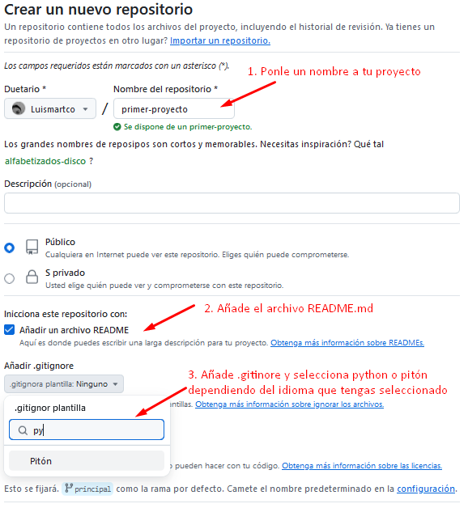
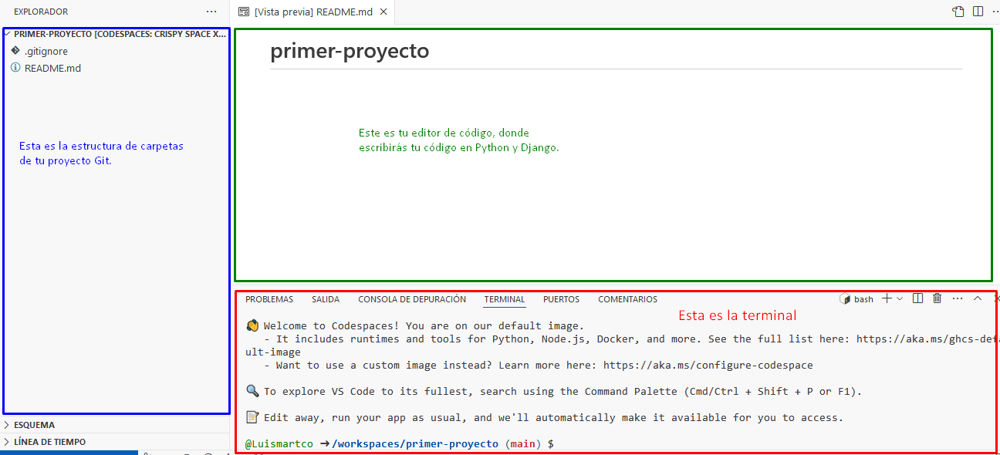

# Configuración de Chromebook

Para las personas que usan un Chromebook o aquellas con memoria limitada en sus computadoras portátiles, recomendamos usar un entorno IDE en la nube. Esto le permite interactuar con la línea de comandos, Python y Django directamente a través de su navegador, donde ya está instalado un editor de código. En caso de que esté utilizando esta instrucción, algunos pasos del tutorial no tienen que hacerse de nuevo ("Deploy/Git" ). Encontrarás una explicación más detallada en la sección "Deploy/Git".

Su experiencia de instalación será un poco diferente.

1. Vaya a [GitHub.com](GitHub.com) y regístrese para obtener una nueva cuenta de usuario gratuita. Asegúrese de recordar su contraseña (agréguela a su administrador de contraseñas, si usa uno).

2. Cree un proyecto de GitHub. Visite este enlace, use el nombre "my-first-blog" para su proyecto y hágalo público (necesario para la implementación, puede hacerlo privado más adelante). Además, agregue un archivo. `README.md` `.gitignore`.

3. Inicia un [Codespace](https://github.com/codespaces/new). Ve a GitHub Codespaces y selecciona el repositorio que acabas de crear. Haz clic en "Crear codespace".

Espera un poco y verás algo así:

El editor [VScode](https://code.visualstudio.com/) se abrirá automáticamente. Si ve una notificación que dice "Instalar Python", haga clic en ella. Si no se te solicita, haz clic en el icono "Extensiones" en la barra lateral izquierda del editor de Codespace. Busque "Python" y haga clic en "Instalar".

De forma predeterminada, el entorno de GitHub Codespace se eliminará después de 1 mes (esto solo se aplica al entorno, no a tu código). Para evitar la eliminación automática, puede ajustar la configuración de la página: [codespaces](https://github.com/codespaces).