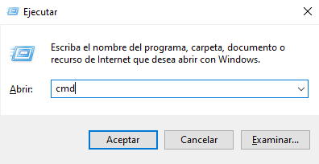

# Breve introducción a la línea de comandos

Dependiendo de su versión de Windows y su teclado, una de las siguientes debe abrir una ventana de comando (es posible que tenga que experimentar un poco, pero no tiene que probar todas estas sugerencias):

   -  Vaya al menú de Inicio o pantalla, y introduzca "Command Prompt" en el campo de búsqueda.
   -  Ir al menú de inicio de la página web de Windows y sistema de Windows.
   -  Ir al menú Inicio - Todos los Programas - Accesorios - Comando Prompt.
   -  Vaya a la pantalla de inicio, flotar el ratón en la esquina inferior izquierda de la pantalla, y haga clic en la flecha hacia abajo que aparece (en una pantalla táctil, en su lugar voltear desde la parte inferior de la pantalla). La página de Aplicas debe abrirse. Haga clic en Comando Prompt en la sección Sistema de Windows.
   -  Sostiene la tecla de Windows especial en tu teclado y presie la tecla "X". Elija "Command Prompt" en el menú emergente.
   -  Sostiene la tecla de Windows y presie la tecla "R" para obtener una ventana "Run". 
   -  Escriba "cmd" en la caja y haga clic en la tecla Aceptar.

Más adelante en este tutorial, tendrás que tener dos ventanas de comando abiertas al mismo tiempo. Sin embargo, en algunas versiones de Windows, si ya tiene una ventana de comando abierta y trata de abrir una segunda usando el mismo método, en su lugar le apuntará a la ventana de comando que ya tiene abierto. Pruébalo ahora en tu computadora y ver qué pasa. Si sólo obtiene una ventana de comando, pruebe uno de los otros métodos de la lista anterior. Al menos uno de ellos debería dar lugar a la apertura de una nueva ventana de comando.