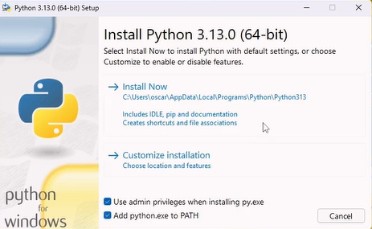

## Instala Python

Django está escrito en Python. Necesitamos a Python para hacer algo en Django. Empecemos por instalarlo.

Primero compruebe si su computadora está ejecutando una versión de 32 bits o una versión de 64 bits de Windows, en la línea "Escriba de sistema" de la página Información del Sistema. Para llegar a esta página, pruebe uno de estos métodos:

- Pulse la tecla de Windows y la tecla R al mismo tiempo
- Se le abrirá el run y escribirá "control" para que se abra el panel de control
- Desde el menú de Windows y luego navegue a System & Security, luego Sistema
- Pulse el botón de Windows y luego navegue a Configuración y Sistema Acerca de
- Busca en el menú de inicio de Windows para "Información del sistema". Para hacer eso, haga clic en el botón Inicio o pulse la tecla de Windows, luego comience a escribir `System Information`. Comenzará a hacer sugerencias tan pronto como escribas. Puede seleccionar la entrada una vez que aparezca.

Puede descargar Python for Windows desde el sitio web [Python](https://www.python.org/downloads/windows/). Haga clic en el enlace "Latest Python 3 Release - Python x.x.x". Si su computadora está ejecutando una versión de 64 bits de Windows, descargue el instalador ejecutable de Windows x86-64. De lo contrario, descargue el instalador ejecutable de Windows x86. Después de descargar el instalador, debe ejecutarlo (haga doble clic en él) y seguir las instrucciones allí.



    Nota: Importante darle marcar las casillas donde dicen 'Use admin privileges when installing py.exe' y 'Add python.exe to PATH'

## Comprobar instalacion de py
Para comprobar si lo tiene instalado (y qué versión es), abrir una consola y escriba el siguiente comando:
```bash
py --version
```
`Ejemplo: 3.13.0.`

